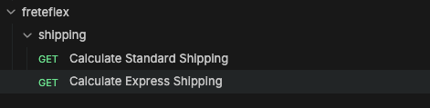

# freteflex

API REST para cálculo de frete, desenvolvida com Spring Boot.

## Endpoints

**GET** `/shipping/calculate`

| Parâmetro      | Tipo   | Descrição                          |
|----------------|--------|------------------------------------|
| `shippingType` | enum   | Tipo de frete: `STANDARD`, `EXPRESS` |
| `distance`     | double | Distância em quilômetros           |
| `weight`       | double | Peso em quilogramas                |

### Fórmulas

- **Standard:** `peso × 1,0 + distância × 0,5`
- **Express:** `peso × 1,5 + distância × 0,75`

### Exemplo de resposta

```json
{
  "shippingCost": 60.0
}
```

## Coleção Bruno

A coleção com as requisições prontas está na pasta `bruno/`. Para usar, abra essa pasta no Bruno e selecione o environment `local`.



## Como executar

```bash
./mvnw spring-boot:run
```

A aplicação sobe na porta `8080`.
